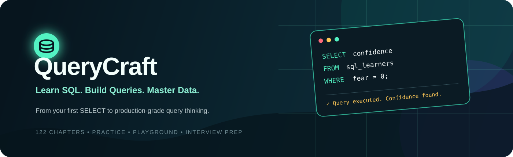
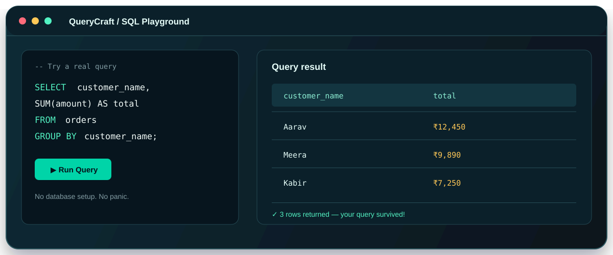

<div align="center">



# QueryCraft

### Learn SQL. Build Queries. Master Data. 🚀

**QueryCraft** is a friendly, interactive SQL learning platform that takes you from  
`SELECT * FROM confused_beginner` to `SELECT * FROM industry_ready_developer`.

<p>
  <a href="https://github.com/shubhamnarware67-cmd/Query-Craft">
    
  </a>
  <a href="https://github.com/shubhamnarware67-cmd/Query-Craft">
    
  </a>
</p>

<p>
  
  
  
  
</p>

</div>

> **SQL tip:** If your query fails, don't panic. Even databases need a little emotional support. 😄

## ✨ What is QueryCraft?

QueryCraft turns SQL learning into a clear, practical journey instead of a scary wall of syntax. Learn a concept, see a real-world example, practice it in the browser, and build confidence one query at a time.

<div align="center">
  
</div>

## 🎯 What you get

| Area | What is inside |
| --- | --- |
| **Course** | 122 chapters across 10 levels, from database basics to production-grade SQL |
| **Playground** | A browser-based SQL learning simulator with sample databases |
| **Practice** | Beginner, Intermediate, Advanced and Industry-level challenges |
| **Interview Prep** | Conceptual and coding questions with explanations and practical tips |
| **Projects** | Real-world database scenarios, including food delivery and e-commerce |
| **Progress** | Your learning progress is saved locally in the browser—no account drama |

## 🧭 Learning roadmap

```text
Foundation → Beginner → Intermediate → Advanced → Industry → Projects → Final Assessment
```

You will explore:

- Databases, DBMS, RDBMS and MySQL fundamentals
- `SELECT`, filtering, sorting, CRUD and table design
- Aggregations, functions, joins, subqueries and CTEs
- Window functions, transactions, indexes and query optimization
- Security, production database practices and system-design thinking
- Real-world database projects and interview-style problem solving

## 🛠️ Tech stack

- **HTML5** for structure
- **CSS3** for the responsive interface, themes and animations
- **Vanilla JavaScript** for navigation, lessons, progress and interactions
- **Browser-based SQL simulator** for safe, setup-free practice
- **No frameworks. No build step. No `npm install` marathon.** 🎉

## 🚀 Run locally

QueryCraft is a static website, so running it is refreshingly simple:

```bash
git clone https://github.com/shubhamnarware67-cmd/Query-Craft.git
cd Query-Craft
```

Then open `index.html` in your browser.

For the smoothest experience, use a small local server:

```bash
# Option 1: Python
python3 -m http.server 8000

# Option 2: VS Code
# Install Live Server → right-click index.html → Open with Live Server
```

Open **http://localhost:8000** and start querying.

## 🌐 Live project

The project is ready to go live, but GitHub Pages is not enabled on the repository yet. Until then, the fastest live experience is the local server command above—your browser becomes the database classroom, minus the tuition fee. 😄

To publish it on GitHub Pages:

1. Open **Settings → Pages** in the repository
2. Select the `new` branch and the `/ (root)` folder
3. Save, then use:

   **https://shubhamnarware67-cmd.github.io/Query-Craft/**

> Once Pages is enabled, this becomes the official **Launch QueryCraft** button target.

## 📁 Project structure

```text
Query-Craft/
├── index.html              # Landing page
├── course.html             # Complete SQL curriculum
├── practice.html           # Practice question bank
├── playground.html         # Browser SQL simulator
├── interview.html          # Interview preparation
├── projects.html           # Project-based learning
├── about.html              # About QueryCraft
├── css/
│   ├── variables.css
│   ├── style.css
│   ├── responsive.css
│   └── animations.css
├── js/
│   ├── data.js
│   ├── sample-data.js
│   ├── sql-engine.js
│   ├── course.js
│   ├── practice.js
│   ├── interview.js
│   └── projects.js
└── assets/
    ├── querycraft-banner.svg
    └── querycraft-preview.svg
```

## 🧪 Playground note

The Playground is an **educational, browser-only SQL simulator**. It works with sample data and intentionally supports a focused set of SQL concepts for learning. It does **not** connect to a real MySQL server or modify production data—which is excellent news for both your database and your sleep schedule. 😴

## 🤝 Contributing

Found a typo, have a better SQL example, or want to add a new practice challenge?

1. Fork the repository
2. Create a branch: `git checkout -b feature/my-sql-improvement`
3. Make your change
4. Commit it: `git commit -m "Add a better SQL example"`
5. Push the branch and open a pull request

Small improvements count. One clearer explanation today can save someone three hours of staring at a missing semicolon tomorrow.

## 👨‍💻 Built by

**Shubham Narware**

QueryCraft is built with plain HTML, CSS and Vanilla JavaScript to stay fast, portable and dependency-free.

- GitHub: [@shubhamnarware67-cmd](https://github.com/shubhamnarware67-cmd)
- Repository: [Query-Craft](https://github.com/shubhamnarware67-cmd/Query-Craft)

## 📄 License

No license file is currently included in the repository. Add a license before distributing or accepting external contributions.

<div align="center">

### Ready to stop fearing SQL?

**Open QueryCraft, write one query, and let the database know who is boss.** 😎

<a href="https://github.com/shubhamnarware67-cmd/Query-Craft">
  
</a>

<br><br>

Made with ☕, curiosity and a suspicious number of semicolons.

</div>